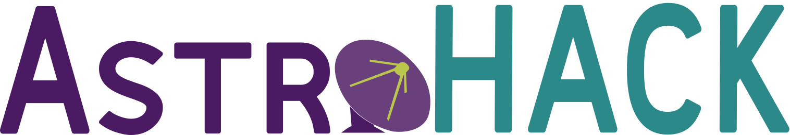

Holography Antenna Commissioning Kit
====================================

(Holography Antenna Commissioning Kit) is a Python package that produces antenna aperture images and panel adjustment corrections from calibrated holography measurement sets. Initially, it will support holography data from the VLA and ALMA, with the future goal of supporting the ngVLA. Much of the core functionality from the following AIPS tasks has been ported: UVHOL, HOLOG, and PANEL. astroHack enables parallel execution by using Dask and efficient single-threaded performance by making use of Numba.

> 📝 astroHACK is under active development! Breaking API changes are still happening on a regular basis, so proceed with caution.

.. toctree::
   :hidden:
   :maxdepth: 4

   introduction
   api
   tutorial_vla
   visualization_tutorial
